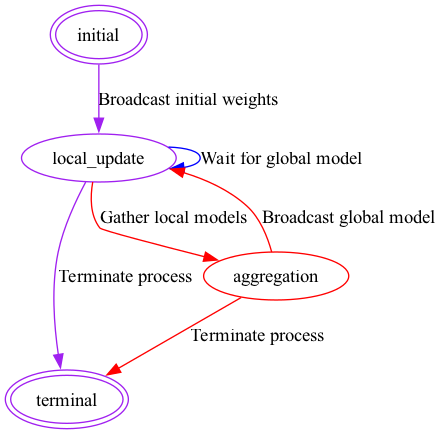

# [FeatureCloud Model Compression]()
### Image Classification with Pruning

This app enables image classification application utilizing pruning techniques for model compression.  The application employs federated learning to train and compress deep neural network models, leveraging the [Torch-Pruning](https://github.com/VainF/Torch-Pruning/tree/master) library.


Image classification is a fundamental task in computer vision, and this app caters to datasets like CIFAR and MNIST. CIFAR-10 and MNIST are widely used benchmark datasets for image classification tasks. CIFAR-10 consists of 60,000 32x32 color images in 10 classes, while MNIST comprises 28x28 grayscale images of handwritten digits.




## Config Settings
### Training Settings
```python
model: model.py
train_dataset: "train_dataset.pth"
test_dataset: "test_dataset.pth"

batch_size: 256
learning_rate: 0.001

max_iter: 10
```
### Training Options
#### Model
File name will provided as generic data to clients, which later will be imported by the app. The model class should have the name 'Model' and include the forward method. For more details, please refer to the example provided in [models/pytorch/models](/data/sample_data/generic/cnn.py) 

`model`: This field should specify the Python file containing the model implementation. It is expected to be in the .py format.

#### Local dataset

`train_dataset` :  Path to the training dataset.

`test_dataset:` :  Path to the training dataset.

These datasets will be loaded using the `torch.utils.data.DataLoader` class.


#### Training config
`batch_size`: Specifies the number of samples in each training batch.

`learning_rate`: Determines the rate at which the model's parameters are updated during training.

`max_iter` : Defines the maximum number of communication rounds.


### Pruning Settings 
Like optimizers, end-users can specify a loss function and its arguments in the deep learning app in the config file.
PyTorch's loss functions can be imported from [`torch.nn`](https://pytorch.org/docs/stable/nn).
Same as for layers and optimizer parameters, default values will be used for parameters unless it is mentioned in the config file.
```python
reference_model: model.py
example_input: (32, 3, 32, 32)
ignored_layers: None
epochs: 0
learning_rate_finetune: 0.001

pruning_ratio: 0.5
iterative_steps: 1
imp: tp.pruner.importance.MagnitudeImportance(p=2) #  options listed in README
```

#### Pruning Hyper-Parameters config
`reference_model`: Can be same as model or other Python file stored at same place like model. Optional. If no model provided pruned values will be filled 
with zeroes instead of the weights of reference model.

`example_input`: Shape of the input data.

`ignored_layers`: Layers to be ignored during pruning. Optional. Last (output) layer will be ignored by default.

`epochs`: Number of epochs for pruning.

`learning_rate_finetune`: Learning rate for fine-tuning after pruning in the Finetuning Process.

`pruning_ratio`: Ratio of pruning. Can be values from 0 to 1. 1 meaning all the values are pruned.

`iterative_steps`: Number of iterative pruning steps of pruning

`imp`: Pruning importance method. Following options available:

    tp.importance.TaylorImportance()
    
    tp.importance.MagnitudeImportance(p=2)
    
    tp.importance.LAMPImportance(p=2)
    
    tp.importance.BNScaleImportance()
    
    tp.importance.GroupNormImportance(p=2)

For more detailed information check [Torch-Pruning](https://github.com/VainF/Torch-Pruning/tree/master) library
    


### Run app

#### Prerequisite

To run the model compression app, you should install Docker and FeatureCloud pip package:

```shell
pip install featurecloud, torch-pruning
```

Then either download the model compression app image from the FeatureCloud docker repository:

```shell
featurecloud app download featurecloud.ai/fc_pruning
```

Or build the app locally:

```shell
featurecloud app build featurecloud.ai/fc_pruning
```

Please provide example data so others can run the model compression app with the desired settings in the `config.yml` file.

#### Run the model compression app in the test-bed

You can run the model compression app as a standalone app in the [FeatureCloud test-bed](https://featurecloud.ai/development/test) or [FeatureCloud Workflow](https://featurecloud.ai/projects). You can also run the app using CLI:

```shell
featurecloud test start --app-image featurecloud.ai/fc_pruning --client-dirs './sample_data/c1,./sample_data/c2' --generic-dir './sample_data/generic'
```

Sources: [Featurecloud] (https://github.com/FeatureCloud)
